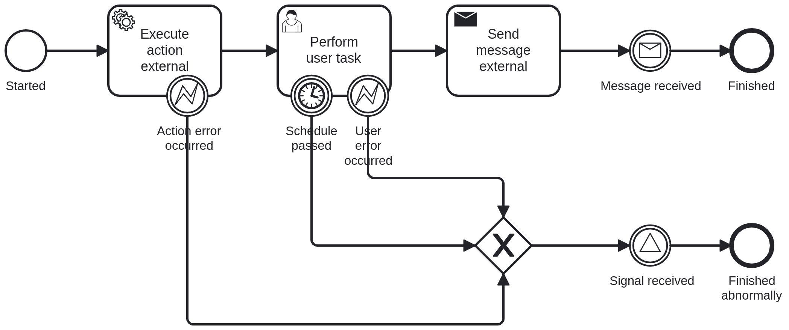

# Java Example to demonstrate usage of process API (Spring Boot 3)

This example is a test that we can invoke API defined in Kotlin from Java. It utilizes the API directly.

It is the Spring Boot 3 twin of `java-cib-seven-embedded`: it runs the same application and tests on
Spring Boot 3.5 with the CIB seven Spring Boot 3 starters (no `-4` suffix), proving that the adapter
starter — although built against Spring Boot 4 — remains compatible with Spring Boot 3.

## ✨ Features in the example

There are some features in the CIB Seven adapter already. In addition, there are some features in the example: 

- AbstractSynchronousTaskHandler to complete external tasks in a synchronous way
- In-Memory user task pool for retrieving infos about open user tasks

## 🔄 Process

## 🚀 How to run

- Build with Maven
- Start `JavaCibSevenExampleApplication`
- Open http://localhost:8080/swagger-ui/index.html
- Start process
- Wait, wait, wait, check the logs, wait...
- Copy the resulting retrieved user task id
- Complete the user task with id
- Wait, wait, wait, check the logs, wait...
- Correlate message by providing the process instance id
- Hint: don't hurry, the error of correlation is not implemented yet (if you try it before both tasks are executed)

## 🧪 How to run using IntelliJ test script
- Build with Maven
- Start `JavaCibSevenExampleApplication`
- Run `simple-process-demo.http` script
- Analyze the results
- Run `simple-process-demo-failed-user.http` script
- Analyze the results
